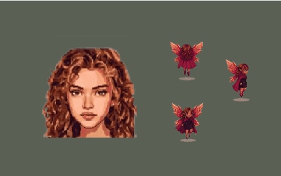
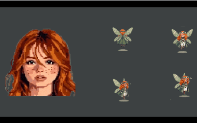

# 2D Pixel Mystery & Farming RPG: Concept & UI/UX Design

**Project Overview & Vision**
This repository serves as the core Game Design Document (GDD) and UI/UX asset library for an original 2D pixel art indie game. Blending cozy resource-management mechanics with psychological mystery and deduction, this project demonstrates product vision, user journey mapping, and visual design execution.

The game explores a seemingly utopian fairy society where suppressed emotions manifest as physical corruption on the land. The player must balance restoring the environment by day with investigating the dark truth by pitch-black night.

**Role:** UI/UX Designer, IT Business Analyst & Pixel Artist
**Design Tools:** Figma (Interactive Components, HUD), Krita (2D Pixel Art, Character Assets, Animation)

---

##  Interactive UI/UX Prototypes
All interactive menus, inventory systems, and dialogue interfaces are modeled to ensure a seamless user experience. The UI is designed to switch tones between the vibrant "Day" farming mode and the suspenseful "Night" investigation mode.

> **[ Click Here to Experience the Interactive Figma Prototype](https://www.figma.com/proto/dPzmgLTDJggTByUTGQflDZ/Avatar-and-other-tiny-details?node-id=17-171&t=T10Ng9pkyEdpzMRX-1&scaling=min-zoom&content-scaling=fixed&page-id=0%3A1)**

---

##  Core Game Mechanics & System Economy
Approaching game design with an analytical mindset, the core features are structured as interconnected state machines:

* **Day/Night State Transitions:** 
  * *Day_State (06:00 - 18:00):* Farming, NPC interaction, and resource gathering. 
  * *Night_State (20:00 - 02:00):* NPCs retreat. Total darkness falls, limiting visibility to the `Cursor_Light_Radius`.
* **The Void Craters (Environmental Puzzle):** Repressed emotions tear physical holes in the town's fabric (`Farmable_Zone = False`). The player must cultivate specific "healing crops" (2-5 days growth cycle) to seal craters and restore the land.
* **Cursor-Driven Stealth & Discovery (Night Phase):** In pitch-black environments, the player's cursor acts as a localized light source, revealing neon-colored "Emotion Trails" (e.g., Red for Anger, Blue for Sadness) left by victims. 
* **Resource Economy:** Balancing stamina and time between classic cozy farming, crafting investigative tools, and brewing emotional remedies.

---

##  Narrative Architecture & Logic Trees
The narrative provides continuous engagement through environmental storytelling and branched decision trees.

* **Core Lore - "The Perfect Stage":** The fairy town is a flawless utopia governed by strict roles. Negative emotions are forbidden, forcing citizens to suppress their true feelings, which secretly manifest as Void Craters.
* **The Antagonist (Ahenk Perisi):** Driven by structural perfection, she secretly harvests "inefficient" emotions to build a dystopian, emotionless underground garden.
* **Dialogue Branching:**
  * *State_A (Corrupted):* NPC speaks monotonously; quests/shops are locked.
  * *State_B (Healing):* Healing crop applied. NPC provides fragmented, contradictory clues (alibis).
  * *State_C (Restored):* True quest line unlocks; NPC begins rebelling against the system.

---

##  Character Database & System Requirements

### 1. Core Entities (Defined System Objects)
Core characters integrated into the primary gameplay loop with defined business logic and state machines.

**The Mayor (Muhtar)**

* **System Function (Day):** Main quest provider. Approves farm expansions.
* **Psychological Trigger (Night):** Control / Anxiety.
* **Data Mapping (Night Trail):** Dashed "Yellow" neon trails clustered around the town square.
* **Unlock Condition:** Dialogue tree unlocks after sealing the Tier 3 Void Crater.

**Honey Fairy (Bal Perisi)**

* **System Function (Day):** Architect responsible for building upgrades and storage capacity.
* **Psychological Trigger (Night):** Severe Burnout.
* **Data Mapping (Night Trail):** Heavy, slow-moving "Amber/Gold" trails near construction zones.
* **Unlock Condition:** Active quest loop triggers upon the first building upgrade request.

**Spark Fairy (Kıvılcım Perisi)**

* **System Function (Day):** Tavern owner selling consumable items for rapid stamina regeneration.
* **Psychological Trigger (Night):** Suppressed, uncontrolled Anger.
* **Data Mapping (Night Trail):** Sharp, flashing "Red" trails spawning at the forest border.
* **Unlock Condition:** Spawns the night after the player consumes their first energy item.

**Dew Fairy (Çiy Perisi)**

* **System Function (Day):** Botanist providing rare (Tier 2/Tier 3) healing seeds.
* **Psychological Trigger (Night):** Paralyzing Fear of the outside world.
* **Data Mapping (Night Trail):** Faint, trembling "Cyan" trails hidden in greenhouse corners.
* **Unlock Condition:** Inventory unlocks after the player successfully closes their first Tier 1 crater.

### 2. Modular Asset Pool (Product Backlog)
Completed visual assets acting as symbolic placeholders, ready to be assigned to system functions and quest lines in future development sprints.

| Asset Code | Status | Visual Theme & Symbolism | Potential Trigger (Night Phase) | Backlog System Function |
| :--- | :--- | :--- | :--- | :--- |
| **NPC_01** | Portrait Ready | Earth tones, exhausted eyes. | Laziness / Apathy | Potion & Fertilizer Crafting |
| **NPC_02** | Portrait Ready | Prismatic, delicate. | Arrogance / Alienation | Tool & Equipment Repair |
| **NPC_03** | Portrait Ready | Dark colors, asymmetrical. | Paranoia / Suspicion | Clue & Secret Vendor |
| **NPC_04** | Portrait Ready | Flowing, windy details. | Impatience | Fast Travel Courier |
| **NPC_05** | Portrait Ready | Messy, patched clothing. | Disappointment | Scrapper / Recycler |
| **NPC_06** | Portrait Ready | Pale skin, mysterious aura. | Deep Regret | Lore / Storyteller |
| **NPC_07** | Portrait Ready | Bright, eye-catching. | Jealousy | Cosmetic Items Merchant |
| **NPC_08** | Portrait Ready | Ink-stained fingers, glasses. | Inadequacy | Archivist / Map Revealer |
| **NPC_09** | Portrait Ready | Sharp features, stern. | Strict Conformity | Night Patrol / Stealth Hazard |
| **NPC_10** | Portrait Ready | Layered, knotted details. | Confusion / Loss of Focus | Exchange / Trade Market |
